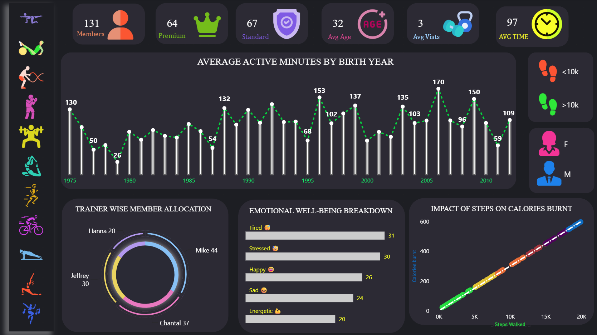
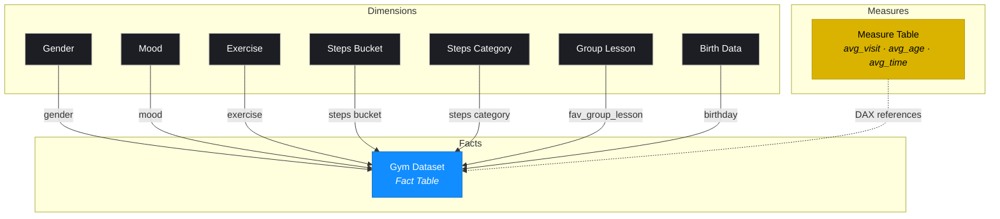
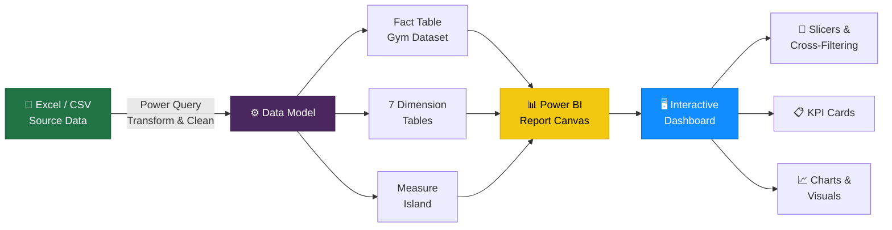

# 🏋️ Gym Member Analytics Dashboard


> A single-page Power BI dashboard that equips gym owners with a real-time view of membership composition, trainer performance, member behaviour, and physical activity trends — purpose-built for data-driven decisions on staffing, retention, and programme design.

---

## 📊 Dashboard Preview



---

## 📋 Project Overview

| Attribute | Detail |
|-----------|--------|
| **Tool** | Microsoft Power BI Desktop (June 2026) |
| **Theme** | CY25SU11 (Fabric base theme) |
| **Canvas** | 1280 × 720 px (16:9, Fit to Page) |
| **Pages** | 1 (Main) |
| **Data Source** | Excel / CSV flat file |
| **Refresh** | Manual (Power BI Desktop → Refresh) |
| **Report Version** | 3.0.0 (Fabric definition format) |

---

## ✨ Features

- **6 KPI metric cards** with custom icons — Members, Premium, Standard, Avg Age, Avg Visits, Avg Time
- **Star schema data model** — 1 fact table, 7 dimension tables, 1 measure island
- **3 interactive slicers** — Group Lesson, Steps Category, Gender
- **Cross-filtering** enabled globally across all visuals
- **Dark-themed canvas** (`#1D1E23`) for enhanced chart contrast and modern aesthetics
- **Combo chart** — dual-axis age group × active minutes analysis
- **Donut chart** — trainer-wise member allocation
- **Mood analysis** — emotional well-being breakdown with emoji labels
- **Steps vs Calories** — line chart showing calorie efficiency by step tier

---

## 🎯 Business Problem

Gym owners and operators need to understand their membership base at a glance — who their members are, how engaged they are, which trainers are overloaded, and what activity patterns emerge across demographics. This dashboard consolidates scattered Excel data into a single, interactive view that answers these questions instantly, enabling faster decisions on staffing, retention campaigns, and programme scheduling.

---

## 📄 Dashboard Pages

This is a **single-page dashboard** designed with a four-zone layout:

```
┌──────┬──────────────────────────────────────────────────┬───────┐
│      │  KPI STRIP  (6 metric cards + custom icons)      │       │
│ LEFT │──────────────────────────────────────────────────│ RIGHT │
│      │                                                  │       │
│ SIDE │   WIDE COMBO CHART  (Age group × Active mins)   │  COL  │
│ BAR  │        Dual-axis line + column combo             │       │
│      │──────────────────────────────────────────────────│ Steps │
│Group │  DONUT        │  BAR CHART    │  LINE CHART     │ slcr  │
│lesson│  Trainer      │  Mood         │  Steps vs       │Gender │
│slicer│  allocation   │  breakdown    │  Calories       │slicer │
└──────┴───────────────┴───────────────┴─────────────────┴───────┘
```

---

## 📈 Key KPIs

| KPI | Measure | Icon | Description |
|-----|---------|------|-------------|
| **Total Members** | `COUNT(id)` | 👤 | Total active membership count |
| **Premium** | Filtered count | 👑 | Members on the Premium tier |
| **Standard** | Filtered count | ✅ | Members on the Standard tier |
| **Avg Age** | `avg_age` | 🎯 | Mean age of filtered member population |
| **Avg Visits** | `avg_visit` | 🏋️ | Mean weekly gym visits per member |
| **Avg Time** | `avg_time` | ⏱️ | Mean session duration in minutes |

---

## ❓ Business Questions Answered

| # | Business Question | Visual |
|---|-------------------|--------|
| 1 | How many active members and what is the Premium vs Standard split? | KPI cards |
| 2 | What is the average age, visit frequency, and session duration? | KPI cards |
| 3 | Which trainer has the largest share of member assignments? | Donut chart |
| 4 | Do different age groups show different activity levels? | Combo chart |
| 5 | What is the relationship between steps and calories burned? | Line chart |
| 6 | How does post-workout mood distribute across members? | Bar chart |
| 7 | How does activity differ by gender or preferred group lesson? | Slicers |

---

## 🗂️ Data Model

The data model follows a **star schema** — a single fact table surrounded by seven dimension tables and one isolated measure island.



> **Why a disconnected Measure Table?** All DAX measures are stored in an isolated `Measure_table` — a best practice that separates business logic from raw data columns and keeps the field list clean.

---

## 🏗️ Architecture



---

## 🛠️ Tech Stack

| Technology | Usage |
|------------|-------|
| **Power BI Desktop** | Report authoring, data modelling, DAX measures |
| **Power Query (M)** | Data extraction, transformation, and loading |
| **DAX** | Business logic — AVERAGE, COUNT, CALCULATE, DIVIDE |
| **Excel / CSV** | Source data format |
| **Star Schema** | Data model design pattern |
| **Git + GitHub** | Version control and portfolio hosting |

---

## 📁 Repository Structure

```
gym-dashboard/
│
├── README.md                   ← Project overview (this file)
├── LICENSE                     ← MIT License
├── .gitignore                  ← Excludes temp/raw data files
├── Gym_dashboard.pbix          ← Main Power BI report file
│
├── assets/
│   └── screenshots/
│       └── dashboard-overview.png   ← Dashboard screenshot
│
├── docs/
│   ├── data-dictionary.md      ← Column definitions & data types
│   ├── dax-reference.md        ← All DAX measures with descriptions
│   └── interview-prep.md       ← Technical Q&A for hiring conversations
│
└── data-sample/
    └── gym-data-sample.csv     ← Anonymised sample rows (20 records)
```

---

## 📚 Documentation

| Document | Description |
|----------|-------------|
| [📖 Data Dictionary](docs/data-dictionary.md) | Column definitions, data types, and table descriptions for every table in the model |
| [📐 DAX Reference](docs/dax-reference.md) | All DAX measures with business context, plus recommended next measures |
| [🎤 Interview Prep](docs/interview-prep.md) | 16 technical Q&A pairs mapped to common BI/Data Analyst interview questions |

---

## 🚀 Getting Started

### Prerequisites

- [Power BI Desktop](https://powerbi.microsoft.com/desktop/) (free download)
- Windows 10 / 11

### Quick Start

```bash
# 1. Clone this repository
git clone https://github.com/Borrakarthik509/gym-dashboard.git
cd gym-dashboard

# 2. Open the report
#    Double-click Gym_dashboard.pbix  OR  open Power BI Desktop → File → Open
```

Once open in Power BI Desktop:

1. **Home → Transform data → Data source settings** — update the file path to your local data
2. **Home → Refresh** — load the latest data
3. **Home → Publish** — publish to Power BI Service (requires account)

---

## 🔮 Future Improvements

| Priority | Enhancement | Effort |
|----------|-------------|--------|
| 🔴 High | Add a date slicer for month-on-month membership trend analysis | Low |
| 🔴 High | Implement Row-Level Security for multi-branch / multi-trainer views | Medium |
| 🟡 Medium | Add a dedicated Trainer Performance page with per-trainer KPIs | Medium |
| 🟡 Medium | Replace Quick Measures with explicit DAX (`CALCULATE`, `AVERAGEX`) | Low |
| 🟢 Low | Publish to Power BI Service and embed a live link in this README | Low |
| 🟢 Low | Add conditional formatting to KPI cards (green / amber / red) | Low |

---

## 👤 Author

**Lakshmi Karthik Borra**
Data Specialist · Power Platform Developer · Full-Stack AI Developer

[](https://github.com/Borrakarthik509)
[](https://www.linkedin.com/in/karthik524/)
[](mailto:karthik.borra524@gmail.com)

---

## 📄 License

This project is released under the [MIT License](LICENSE).

The data used in this dashboard is either synthetically generated or anonymised for demonstration purposes. No personally identifiable information is included.
